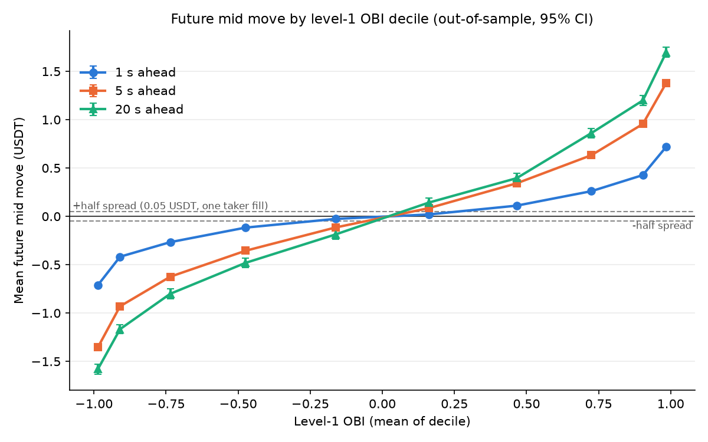
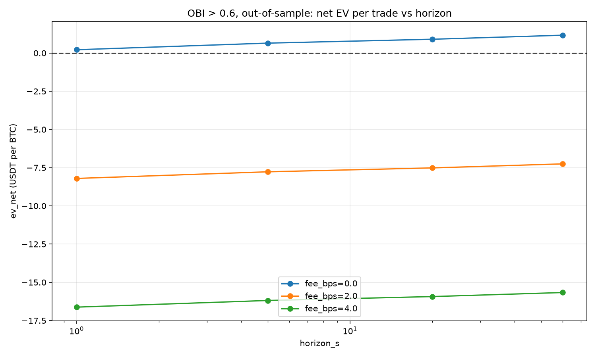
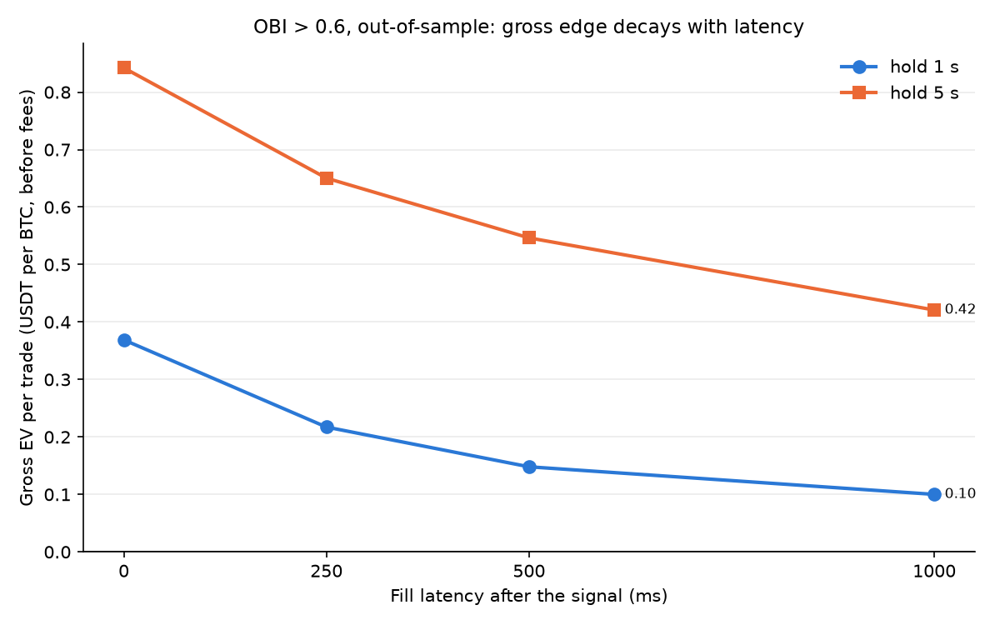
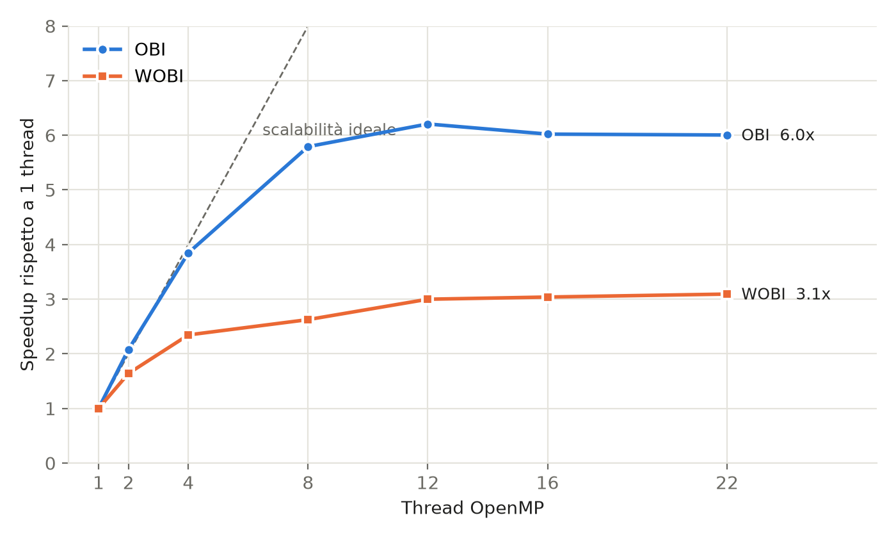

# Order book imbalance on BTC/USDT: does it actually pay?


I wanted to know whether the volume imbalance at the top of the Binance BTC/USDT order book predicts the next price move, and whether you can make money with it as a taker. It does predict the move, clearly and out-of-sample. But the edge is worth about 0.04–0.3 bp per side, while a taker on Binance futures pays 1.7–5 bp, so every version of the strategy I tested loses money once costs are in.

This repo is the second version of the project. The first one reported a win rate above 90% that I haven't been able to reproduce, and most of what I learned came from not trusting it and redoing the analysis properly.

> 📄 **Full report (PDF, 18 pages, in Italian): [docs/report/strategy_report.pdf](docs/report/strategy_report.pdf)**
> Data, signal definitions, execution model, all results tables and what went wrong in the first version.

## Why I built this

I'm Gianleonardo Salvemini. I did my BSc in Mathematical Engineering and I'm now in the first year of the MSc in Quantitative Finance at Politecnico di Milano. I had never looked at market microstructure before and I wanted to throw myself into it, without big ambitions, just to learn something. I think a hands-on project teaches you much more than going through lecture note after lecture note, and it is also a lot more fun.

The starting question was simple. Level-1 order book imbalance is

```
OBI = (V_bid - V_ask) / (V_bid + V_ask)
```

computed on the volumes at the best bid and best ask. If there is much more size on the bid than on the ask, does the mid price tend to go up in the next second? And if it does, is that tradable?

## What I found

Data: 3.73M snapshots of the BTCUSDT perpetual book, one every ~250 ms, 10 levels per side, 9 to 20 January 2023. I split it chronologically: the first 70% is in-sample, the last 30% (about three days) is out-of-sample. Everything below is out-of-sample, with 250 ms of latency between signal and fill, PnL per 1 BTC.

OBI threshold 0.6 (go long if OBI > 0.6, short if OBI < -0.6), exit after a fixed wall-clock horizon:

| Horizon | Trades | Mid move (USDT) | Gross EV (USDT) | t-stat | Net EV at 2 bp/side | Net EV at 4 bp/side |
|---:|---:|---:|---:|---:|---:|---:|
| 1 s | 163,365 | +0.54 | +0.22 | 45 | -8.2 | -16.6 |
| 5 s | 46,208 | +0.98 | +0.65 | 33 | -7.8 | -16.2 |
| 20 s | 13,134 | +1.21 | +0.90 | 12 | -7.5 | -15.9 |
| 60 s | 4,521 | +1.50 | +1.17 | 5 | -7.2 | -15.7 |

A few things I take from this:

- The signal is real. Gross EV is positive for every threshold and horizon I tried, in-sample and out-of-sample, with t-stats between 3.6 and 57. The depth-weighted version (WOBI, 10 levels with exponentially decaying weights, plus a micro-price) gives the same picture: with an edge threshold of 0.1 USDT and a symmetric 1 USDT take-profit/stop-loss bracket with a 2.5 s time stop, +0.36 USDT gross per trade out-of-sample, t = 31, 46,123 trades.
- It is also tiny. With BTC around 20k USDT, 1 bp is 2 USDT per side. The gross edge is 0.2 to 1.2 USDT on a round trip, so the fee at which it breaks even is a fraction of a basis point: breakeven fee = gross EV / (2 × price), which gives 0.04 to 0.3 bp per side across all the configurations I tested. On Binance USDⓈ-M futures a taker pays 5 bp at the standard tier and 1.7 bp at the top VIP tier ([fee schedule](https://www.binance.com/en/fee/futureFee)), so even in the best case the fee is more than 5 times the breakeven, and for a normal account up to about 130 times. No parameter tuning closes a gap like that.
- Win rate is a bad metric here. At 1 s the gross win rate is only 32%, because most of the time the mid doesn't move at all within a second, and yet the EV is positive with t = 45.
- The gross EV grows with the horizon, not the other way round. In my first write-up I described an "alpha decay": the longer you hold, the more the edge disappears. That was wrong. What decays is the net result, because costs are fixed while the signal is small, and the significance, because longer horizons mean fewer trades. (The gross EV grows up to 20 s for every threshold; beyond that it mostly keeps growing, with two small dips out of six cases.)



The mean mid move over the next horizon rises monotonically across OBI deciles, so the direction is right. In the extreme deciles the move is well above a full spread (0.1 USDT), so the spread is not what kills the strategy: the fees are, at about 8 USDT per round trip at 2 bp per side.



Latency matters a lot, because most of the move happens right after the signal. For OBI 0.6 out-of-sample:

| Latency | Gross EV at 1 s | Gross EV at 5 s |
|---:|---:|---:|
| 0 ms (not realistic) | 0.37 | 0.84 |
| 250 ms | 0.22 | 0.65 |
| 500 ms | 0.15 | 0.55 |
| 1000 ms | 0.10 | 0.42 |



So a zero-latency backtest overstates the 1-second edge by about 70%. This was one of the bugs in the first version.

## The mistakes I made first

The first version of this project (still in [`legacy/`](legacy/), unchanged) was a C engine that updated the book, called from Python through `ctypes` because Pandas was too slow on 3.7M rows. I set a trigger at |OBI| > 0.6, sent a market order in the direction of the imbalance, and got a win rate above 90%.

I didn't believe it, and that was the right instinct. I started thinking about it the way I think about pot odds in poker: a hand you win most of the time can still be a losing call if what you pay to see it is larger than what you win on average. So I started computing expected value net of costs instead. Re-running that original method today, 0.5 USDT of round-trip slippage is already enough to make the 1 s and 5 s results negative. My conclusion then was that taking liquidity loses, and that the signal might be more useful for asymmetric market making: quoting passively on the strong side of the book instead of crossing the spread.

That conclusion survived. Most of the evidence behind it didn't. When I went back and reviewed the code properly, I found:

1. Volumes truncated to `int`, in the C struct and in the Python parsing. BTC sizes are fractional, so a level with 0.4 BTC became 0. With truncation, 26.5% of snapshots had OBI exactly ±1; computed correctly, 0%. My original write-up said OBI "constantly saturates towards ±1". That was the bug talking.
2. The DLL paths were wrong, so 3 of the 4 scripts using `ctypes` crashed on import.
3. The WOBI entry filter was `edge > 0.2 + spread + mid * 0.0004`. That adds a percentage fee (about 8 USDT at these prices) to an edge that is almost never above 1 USDT. The condition was true on 5 snapshots out of 3.73M, so the strategy essentially never traded.
4. The WOBI take-profit was set at the micro-price, which is below the entry price once fees are included. Trades marked "take profit" were losing money.
5. Fills happened on the same snapshot as the signal: zero latency.
6. No fees at all in the OBI backtest.
7. Horizons were counted in ticks, not time. The full data has 296 gaps longer than 500 ms, the longest 93 s, so on the full dataset a "1 second" trade counted in ticks could last over a minute.
8. Everything was in-sample, on the first 100k rows.

And the 90%: I no longer have the code that produced it, and I haven't been able to reproduce it. Re-running the original method still in the repo (first 100k rows, zero latency, no fees) gives a win rate between 15% and 55% depending on the horizon, with either float or int volumes. The int bug explains the saturation I saw in the plots, but not the win rate. I don't know how that number was computed, so I treat it as unreliable and don't draw any conclusion from it.

## How it works

I rebuilt it from scratch, keeping the original only for comparison.

- `engine/`: one C11 engine with one shared header (`lob_engine.h`). Before there were two incompatible structs with the same name. The batch functions take the whole `(n, 40)` NumPy array in the CSV column order, so there is no copy and one FFI call per dataset instead of one per tick. The loop is parallelised with OpenMP. Single-snapshot functions exist too, for streaming use.
- `src/lobimb/`: the Python package. `data.py` parses the CSV once into a memory-mapped `.npy` cache and runs sanity checks, `signals.py` computes OBI, WOBI, micro-price and spread, `backtest.py` runs the taker backtests, `metrics.py` computes EV, t-stat, drawdown and so on.
- `reference.py` reimplements every signal in plain NumPy, and the tests check the C engine against it to 1e-12, including a regression test for fractional volumes.

The backtest assumptions are explicit and live in one place (`config.py`):

- taker only: a signal at snapshot *t* fills at the first snapshot at or after *t* + 250 ms, at the touch plus slippage;
- fees charged on both legs;
- horizons in wall-clock milliseconds; trades that span a data gap longer than 2 s are dropped;
- one position at a time, PnL per 1 BTC;
- 70/30 chronological in-sample / out-of-sample split.

What it does not model: queue position, passive fills, and market impact beyond flagging trades larger than the top-of-book size.

## Performance

Intel Core Ultra 7 155H, 22 logical CPUs, full dataset (3.73M snapshots):

| Path | Full dataset | Per snapshot |
|---|---:|---:|
| Original scripts (ctypes call per tick) | 24.6 s | 6.6 µs |
| NumPy, vectorised | 0.97 s | 261 ns |
| C batch, 1 thread | 0.087 s | 23 ns |
| C batch, 22 threads | 0.028 s | 7.6 ns |

That is about 870x over the original. For a single snapshot, the C kernel takes ~20 ns (p50) while the same call from Python through `ctypes` takes ~1 µs: the kernel is fast, and the time goes into the interpreter and the FFI boundary. The whole research pipeline (both signals and both backtests on the full dataset) now runs in about 1.8 s.

The old README said the engine used multithreading. It didn't: there was no threading anywhere in the code. It does now, but the scaling flattens early (3.1x for WOBI and 6x for OBI at 22 threads). Each snapshot is 320 bytes and the kernels do well under one flop per byte (about 0.3 for WOBI, far less for OBI), so they are limited by memory bandwidth, not by the CPU.



Full numbers are in [docs/BENCHMARKS.md](docs/BENCHMARKS.md).

## Limitations and what I'd do next

The main limit isn't in the code. The edge is roughly 5 to 130 times smaller than taker costs, so the only way this signal could be useful is passive execution, and I can't test that honestly with this data. With 250 ms snapshots and no trade feed I can't see what happens between two snapshots, I can't estimate queue position, and I can't tell whether a limit order would have been filled. The asymmetric market-making idea from my first version is still just an idea.

Other things I'm aware of:

- One instrument, 11 days in January 2023, about 3 days out-of-sample. No walk-forward, no other periods or assets.
- The t-stats assume independent trades, but consecutive trades overlap and are autocorrelated, so they are overstated. I also looked at 21 configurations (12 OBI, 9 WOBI), each in-sample and out-of-sample, which is a multiple-testing problem I haven't corrected for.
- The multi-level micro-price pairs bid level *i* with ask level *i*. It's a heuristic, not the Stoikov micro-price.

If I continue, the order would be:

1. Get incremental L2 book data plus trades with exchange timestamps (recording the Binance websocket myself, or a historical provider).
2. Write an event-driven, queue-aware simulator for passive orders, and only then test imbalance-driven quoting: skewing quotes, pulling the weak side, managing inventory.
3. Walk-forward validation, Newey-West or block-bootstrap standard errors, and a correction for multiple testing.
4. Better features, starting with order flow imbalance computed on book updates, evaluated with out-of-sample R² instead of fixed thresholds.

## Reproduce it

Requirements: Python 3.10+, CMake 3.20+, a C11 compiler with OpenMP (GCC/MinGW-w64, Clang or MSVC).

The data is the Kaggle dataset [Bitcoin Limit Order Book (LOB) Data](https://www.kaggle.com/datasets/siavashraz/bitcoin-perpetualbtcusdtp-limit-order-book-data): BTCUSDT perpetual, 2023-01-09 to 2023-01-20, 3.73M snapshots, 10 levels. Put the CSV at `data/raw/1-09-1-20.csv`. The full file is 1.2 GB, so the repo only ships the first 100k snapshots (about 7 hours, 3 MB gzipped) in `sample_data/`; the dataset is MIT-licensed, see [sample_data/README.md](sample_data/README.md). That is enough to run everything and see the signal, though the numbers above come from the full dataset. `make_sample_data.py` can also generate a synthetic file with the same schema (the tests use it).

```bash
pip install -e ".[dev]"
python scripts/build_engine.py            # builds build/bin/lob_engine.{dll,so}
pytest                                    # correctness tests

# with the 100k-row excerpt in the repo
python scripts/prepare_data.py --csv sample_data/btc_lob_sample_100k.csv.gz --cache data/sample_real/cache
python scripts/run_obi_sweep.py --cache data/sample_real/cache --out results/sample --figures results/sample

# with the real data
python scripts/prepare_data.py            # CSV -> memory-mapped .npy cache (one-off, ~15 s)
python scripts/run_obi_sweep.py           # OBI sweep, IS/OOS, fees, latency -> results/
python scripts/run_wobi_strategy.py       # WOBI + micro-price strategy -> results/
python scripts/run_signal_analysis.py     # decile and latency figures
pytest -m bench -s                        # latency KPI tests with budgets
python scripts/run_benchmarks.py          # regenerates docs/BENCHMARKS.md
```

The full write-up, with methodology and all the tables, is in [docs/report/strategy_report.pdf](docs/report/strategy_report.pdf) (in Italian; LaTeX source in the same folder).

## Repo layout

```
engine/          C11/OpenMP engine: include/lob_engine.h, src/lob_engine.c, bench/
src/lobimb/      Python package: data, engine (ctypes), signals, backtest, metrics, reference, plots
scripts/         build, data preparation, experiments, benchmarks
tests/           correctness tests; tests/bench/ for latency KPIs (pytest -m bench)
legacy/          the original version, unchanged, for before/after comparison
sample_data/     first 100k snapshots of the real dataset (gzipped)
docs/            BENCHMARKS.md, figures/, report/ (LaTeX write-up)
results/         CSV outputs of the experiments (generated, not in git)
```

## A note on tools

I used AI coding assistants to help with the refactoring, tests and documentation. The research question, the analysis choices and the conclusions are mine.

## License

Code: MIT, see [LICENSE](LICENSE). Data excerpt: MIT, from the original Kaggle dataset (see [sample_data/README.md](sample_data/README.md)).
